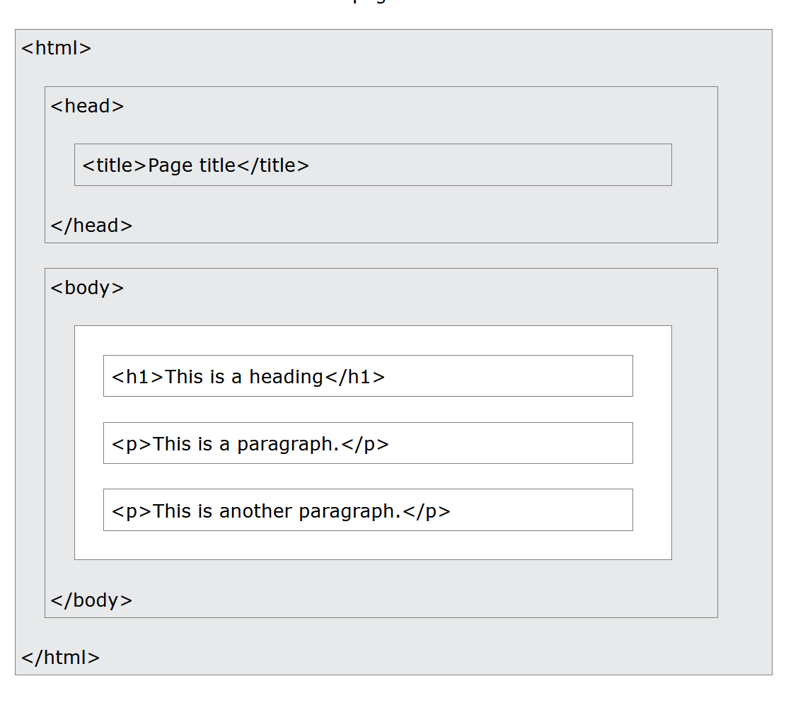

# HTML intro

04/05/2023

## Page Structure

* peep the boxes 

   

   

## __Elements__

 

### __Structural elements__

* `<!DOCTYPE html>`
    * declares document as an HTML 5 one
* `<html></html>`
    * contains all other elements
* `<head></head>`
    * holds meta data
* `<body></body>`
    * holds display info

### __Double tag elements__

`<h1> </h1>`
* header tag-> (gets pulled by search engines)

`
 
` 
* paragraph tag-> always starts a new line, and gets a margin
    * defaults to giving info on a single line. Even if you type multiple

`` 
* link tag

`<pre> </pre>`
* shows preformatted text
    * If you [enter] multiple lines in a `<pre>`, they'll be preserved

### __Single tag elements__

` ` 
* line break tag
    * can be placed mid text tag

``
* image tag

`
`
* horizontal rule-> separates content with a literal line
    * can be mid line like ` `

### <b>Text formatting tags</b>
    all of these are double tagged

* bold: `<b>`
    * <b> it's bold </b>
* important text: `<strong>`
    * <strong> is bold but important </strong>
* italics: `<i>`
    * <i> italics </i>
* emphasized text: `<em>`
    * <em> screen readers pronounce this was oomph </em>
* marked text: `<mark>`
    * <mark> highlit </mark>
* smaller text: `<small>`
    * <small> did you set the belt to wumbo? </small>
* deleted text: `<del>`
    * <del> struck through </del>
* inserted text: `<ins>`
    * <ins> underlined </ins>
* subscript text: ``
    *  the reddit tag 
* superscript text: ``
    *  the skater tag 

### __Citation and Quotation tags__

* block quotes: `<blockquote>`
    * <blockquote> just toss a ton of words into this block so that we can have a block of a quote </blockquote>
* short quotes: `<q>`
    * <q> i like trains </q>
* abbreviations: `<abbr>`
    * 
 the <abbr title="doctor"> dr.</abbr> was tired.

* contact info: `<address>`
    * <address>
        Written by Damisi  
        Email at: email.gmail.com  
        this is italics  
        Finland
    </address>
* define title: `<cite>`
    * 
 <cite> the alchemist </cite> by some one. At some time 

* bi-directional override: `<bdo>`
    * <bdo dir="rtl"> This can only be beaten by racecar! </bdo>

   

   

## __Element Attributes__

 

* attributes are always declared in the start tag.

``     
* href: to show a hyperlink
* ``

``
* src: links pic to element
* ``
* also: alt="" width="", height=""
    * alt: shows text if the image doesn't load
    * width/height control the img size
    * ``
* note -> links can be local (peep above) or absolute (web links)

`

`
* style: inline css 
* `

`
* title: mouse over title
* `

`

`<html></html>`
* lang: sets file language
* `<html lang="en"></html>` 
    * sets to English

### **Note:** 
    You don't need to quote attribute values. But it is convention, you can single quote, double quote. Even no quote if you're crazy, though you can't have a space if that's the case.

* `<a href="pic/this">` 
* `<a href='pic/this'>`
* `<a href=pic/this>`
* ~~`<a href=pic this>`~~ 
    * no space with no quotes

   

   

## **Links**

### **Gen**

* absolute path    
    * ``
* relative path
    * ``

            Note: after opening an absolute path, the related pages can be linked relatively if they're stored in the same folder

* target attributes
    * `<a href="https://www.website.com/" target="_[target_attribute]">link text</a>`

            target attributes:
                * _self -> opens in current tab
                * _blank -> opens in new tab
                * _parent -> opens in parent frame
                * _top -> opens in full body of window
                    
                    though to be honest... I don't know the difference between _self/_parent/_top

* image as a link
    * place `` tag within `<a>` tags
            
            

* link to email
    * `<a href="mailto:email@email.com">contact [____]</a>`
    * the magic is in the 'mailto:'
* button as a link
    * `<button onclick="document.location='default.asp'";>button name</button>`
    * `onclick` is java script
* link titles
    * `<a href= "https://www.website.com/" title="Open website">Website</a>`
    * gives extra info in the hover pop-up

### **Link CSS**

* Changing colors
    * link (unvisited link) - not underlined
    * visited - not underlined
    * hover - underlined
    * active - underlined

            

* Button styling
    * css 
    
            

### **Bookmarks or jump-to**
* set id attribute to make bookmark
    * `<h2 id="c2>Chapter 2</h>`
* link to said header
    * `<a href="#c4">To Chapter 2</a>`
* link a bookmark to a different page
    * `<a href="webpage.html#c4">To Chapter 2</a>`

   

   

## _Styles aka **CSS**_    
 

### _Syntax_
* inline
    * within element tag
            
            `<tag_name style= "property:value;">`

* internal
    * within the `<head>` tag

            <head>
                
            </head>

* external
    * in an external .css file

             p{
                color:blue;
            }
        
### _Link to external css_
* place link in `<head>` tag
* absolute path
    * `<link rel="stylesheet" href="https://website.com /css/styles.css">`
* relative path
    * `<link rel="stylesheet" href="/css/styles.css">`
    * **note:** if css file is in the same folder as the html file, the file name will suffice

### _Properties_
* background color
    * `background-color: color_name;`
* border
    * `border: 00px solid gray;`
* margin -> space outside border
    * `margin: 00px;`
* padding -> space between text and border
    * `padding: 00px 00px;`
    * pads space above/below
    * pads space left/right
* text alignment
    * `text-align:center;`
    * can also be right/left etc.
* text color
    * `color:color_name;`
* text fonts
    * `font-family:font_name;`
* text size
    * `font-size:00px;`

### _Colors_
    Supports: color names, or RGB, HEX, HSL, RGBA, or HSLA values.

#### _Attributes_
* background color
    * `style="background-color:blue;"`
* text color
    * `style="color:blue;"`
* border color
    * `style="border: 2px solid blue;"`

#### _RGB(A)_
* syntax: ###, ###, ###
* r- red, g- green, b- blue
    * on a scale of 0-255
* set the 3 values equal for gray
* the a stands for alpha which controls opacity

#### _HEX_
* syntax: #rrggbb
* rr- red, gg- green, bb- blue
    * starts at 00 -> 00-09, 0a-0f -> 10
    * after 9f -> a0-a9, aa-af -> b0
    * ends at ff
* set values equal for gray

#### _HSL(A)_
* syntax: hs1(hue, saturation, lightness)
* h- hue, s- saturation, l- lightness
    * h = degree on color wheel -> 0-360
    * s = percent (gray-color) -> 0-100%
    * l = percent (black-white) -> 0-100%
* the a stands for alpha which controls opacity

#### **Note:**
* color selection
    * blue -> color name
    * 0, 0, 255 -> RGB
    * 0000ff -> HEX
    * 240°, 100, 50 -> HSL

   

   

## **Misc**.

 

### **Comments**
* `<!---->` : that's how you make one